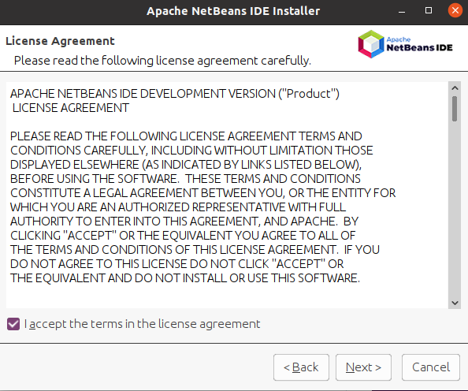
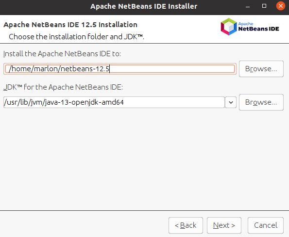

# Instalacion-del-IDE-netbeans-12

**Nombre:** Marlon Farizo Hergueta.

**Curso:** 1º Desarrollo de Aplicaciones Web.

**Asignatura:** Entornos de desarrollo.

### ÍNDICE

+ [Instalación de Netbeans](#id1)
+ [Ejecutando Netbeans 12](#id2)
+ [Eliminar Netbeans](#id3)
+ [Instalación a través de wget](#id4)

### Instalación de Netbeans 

En primer lugar vamos a poner el comando para instalar el Netbeans.

### Ejecutando Netbeans 12 

Escribimos en el terminal Netbeans.

### Eliminar Netbeans 

Usamos el comando para eliminar el Netbeans.

### Instalación a través de wget 

Ponemos el comando de la descarga de wget y lo instalamos con un script y seguimos los pasos que nos pide la instalación.

